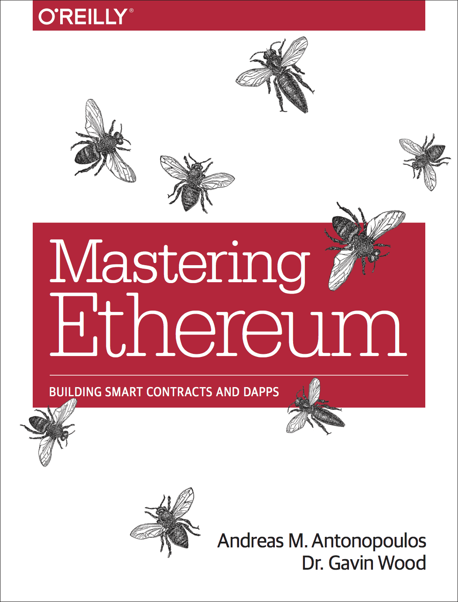

# 精通以太坊 — Mastering Ethereum 繁體中文版

<p align="center">
  
</p>

<p align="center">
  <a href="https://mastering-ethereum.doge.tg/"><strong>線上閱讀</strong></a> ·
  <a href="https://github.com/awesome-doge/ethereumbook_zh/releases/latest">電子書下載</a> ·
  <a href="https://github.com/awesome-doge/ethereumbook_zh">GitHub</a>
</p>

---

由 **Andreas M. Antonopoulos** 和 **Dr. Gavin Wood** 著作，**Dr. Awesome Doge** 翻譯。

本書是 [Mastering Ethereum](https://github.com/ethereumbook/ethereumbook) 的繁體中文翻譯，涵蓋以太坊的完整技術細節。

## 閱讀方式

| 格式 | 說明 |
|------|------|
| [線上閱讀](https://mastering-ethereum.doge.tg/) | 響應式網頁版，支援桌面和手機 |
| [PDF 下載](https://github.com/awesome-doge/ethereumbook_zh/releases/latest) | A4 排版，適合電腦、平板和列印 |
| [EPUB 下載](https://github.com/awesome-doge/ethereumbook_zh/releases/latest) | 適合 Kindle、Apple Books、Kobo 等電子書閱讀器 |

## 目錄

| 章節 | 主題 |
|------|------|
| [前言](preface.asciidoc) | 封面上的蜜蜂有什麼含義？ |
| [術語](glossary.asciidoc) | 快速術語表 |
| [第 1 章](ch01.asciidoc) | 什麼是以太坊 |
| [第 2 章](ch02.asciidoc) | 以太坊基礎 |
| [第 3 章](ch03.asciidoc) | 以太坊客戶端 |
| [第 4 章](ch04.asciidoc) | 以太坊測試網 |
| [第 5 章](ch05.asciidoc) | 密鑰和地址 |
| [第 6 章](ch06.asciidoc) | 錢包 |
| [第 7 章](ch07.asciidoc) | 交易 |
| [第 8 章](ch08.asciidoc) | 智能合約 |
| [第 9 章](ch09.asciidoc) | 開發工具、框架和庫 |
| [第 10 章](ch10.asciidoc) | 代幣 (Tokens) |
| [第 11 章](ch11.asciidoc) | 去中心化應用 (DApps) |
| [第 12 章](ch12.asciidoc) | 預言機 (Oracles) |
| [第 13 章](ch13.asciidoc) | 燃氣 (Gas) |
| [第 14 章](ch14.asciidoc) | 以太坊虛擬機 (EVM) |
| [第 15 章](ch15.asciidoc) | 共識 |
| [第 16 章](ch16.asciidoc) | Vyper |
| [第 17 章](ch17.asciidoc) | DevP2P 協議 |
| [第 18 章](ch18.asciidoc) | 以太坊標準 |
| [第 19 章](ch19.asciidoc) | 以太坊分叉歷史 |

## 構建

本書使用 [AsciiDoc](https://asciidoc.org/) 格式撰寫，以 [Asciidoctor](https://asciidoctor.org/) 構建。

```bash
# 安裝
gem install asciidoctor rouge

# 構建 HTML
asciidoctor -b html5 book.asciidoc

# 構建 PDF（需要額外安裝）
gem install asciidoctor-pdf
asciidoctor-pdf -a pdf-theme=pdf-theme.yml book.asciidoc
```

推送到 `master` 分支會自動透過 GitHub Actions 部署網頁版。推送 `v*` tag 會自動構建 PDF/EPUB 並發布到 GitHub Releases。

## 授權

本書以 [Creative Commons CC-BY-NC-ND 4.0](https://creativecommons.org/licenses/by-nc-nd/4.0/) 授權釋出。

[](https://creativecommons.org/licenses/by-nc-nd/4.0/)
